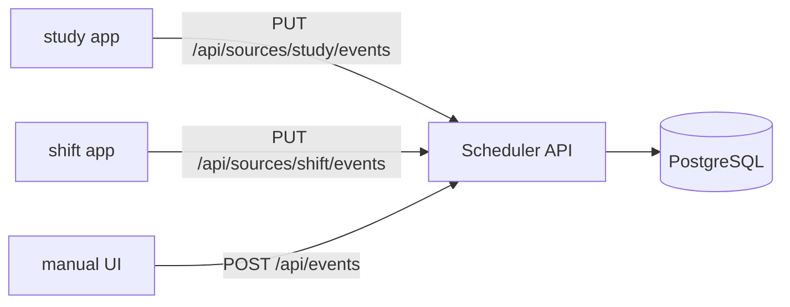

# ソースプラグイン仕様

---

## 概要

Scheduler は「ハブ」として複数のソースアプリからイベントを集約する。各ソースアプリは `ImportEvent` スキーマに従い Scheduler API を叩くだけでよい。**Scheduler 本体のコード変更は不要。**



---

## API エンドポイント

### PUT /api/sources/{source_id}/events — 全件 upsert

ソースの全イベントを一括送信する。送信リストに含まれない既存レコードは論理削除される（差分削除）。

**冪等性**: 何度呼び出しても結果は同じ。定期的な全量送信に使う。

リクエスト:

```
PUT /api/sources/study/events
Content-Type: application/json
```

```json
{
  "events": [
    {
      "source": "study",
      "source_event_id": "session-001",
      "title": "数学の勉強",
      "start": "2026-05-02T09:00:00Z",
      "end": "2026-05-02T11:00:00Z",
      "all_day": false,
      "category": "数学",
      "color": "#27AE60",
      "reminders": [10],
      "metadata": {
        "display": {
          "fields": [
            { "type": "badge",    "label": "教科",   "value": "数学",    "color": "#27AE60" },
            { "type": "progress", "label": "進捗",   "value": 65, "max": 100, "unit": "%" },
            { "type": "text",     "label": "参考書",  "value": "青チャート" }
          ],
          "actions": [
            { "label": "アプリで開く", "url": "studyapp://sessions/session-001" }
          ]
        },
        "raw": {
          "subject_id": 3,
          "textbook_id": 42,
          "progress_percent": 65
        }
      }
    }
  ]
}
```

レスポンス:

```json
{
  "data": {
    "upserted": 1,
    "deleted": 0
  }
}
```

| ステータスコード | 意味 |
|----------------|------|
| 200 | 全件処理完了 |
| 400 | リクエスト形式不正 |
| 422 | バリデーションエラー（詳細は `error.details`） |
| 404 | source_id が sources テーブルに存在しない |

---

### POST /api/sources/{source_id}/events — 個別 upsert

単一イベントを upsert する。イベント発生時のリアルタイム送信に使う。

リクエスト:

```
POST /api/sources/study/events
Content-Type: application/json
```

```json
{
  "source": "study",
  "source_event_id": "session-002",
  "title": "英語の勉強",
  "start": "2026-05-03T14:00:00Z",
  "end": "2026-05-03T15:30:00Z",
  "all_day": false
}
```

レスポンス:

```json
{
  "data": {
    "id": "550e8400-e29b-41d4-a716-446655440000",
    "source_event_id": "session-002",
    "created": true
  }
}
```

`created: false` の場合は既存レコードへの update を意味する。

---

### DELETE /api/sources/{source_id}/events/{source_event_id} — 個別削除

単一イベントを論理削除する。

リクエスト:

```
DELETE /api/sources/study/events/session-001
```

レスポンス: `204 No Content`

---

### GET /api/events — イベント一覧取得

**期間指定必須。** `from` と `to` が両方指定されていない場合は 400 を返す。

```
GET /api/events?from=2026-05-01&to=2026-05-31
```

クエリパラメータ:

| パラメータ | 型 | 必須 | 説明 |
|-----------|-----|------|------|
| `from` | YYYY-MM-DD | 必須 | 取得開始日（Asia/Tokyo 基準） |
| `to` | YYYY-MM-DD | 必須 | 取得終了日（Asia/Tokyo 基準） |
| `source` | string | 任意 | ソースで絞り込み（カンマ区切り複数可） |

レスポンス:

```json
{
  "data": [
    {
      "id": "550e8400-...",
      "source": "study",
      "title": "数学の勉強",
      "start": "2026-05-02T09:00:00Z",
      "end": "2026-05-02T11:00:00Z",
      "all_day": false,
      "color": "#27AE60",
      "ownership": "source",
      "metadata": { "display": { ... } }
    }
  ],
  "meta": {
    "total": 1,
    "from": "2026-05-01",
    "to": "2026-05-31"
  }
}
```

---

## ImportEvent スキーマ詳細

```typescript
type ImportEvent = {
  source: string;               // sources.id に一致すること
  source_event_id: string;      // ソース内でユニークなID (最大 255 文字)
  title: string;                // 必須 (最大 500 文字)
  start: string;                // ISO 8601 必須 (例: "2026-05-02T09:00:00Z")
  end: string;                  // ISO 8601 必須 (start より後)
  all_day: boolean;             // 必須
  location?: string;            // 最大 500 文字
  description?: string;         // 最大 5000 文字
  category?: string;            // 最大 100 文字
  color?: string;               // #RRGGBB 形式
  reminders?: number[];         // 各要素は 0〜10080 分（1週間）
  metadata?: ImportEventMetadata;
};

type ImportEventMetadata = {
  display?: {
    fields?: DisplayField[];    // 最大 20 個
    actions?: DisplayAction[];  // 最大 5 個
  };
  raw?: unknown;                // 任意のJSON (最大 64KB)
};
```

---

## Display Field type 一覧

| type | 用途 | 必須プロパティ | 任意プロパティ |
|------|------|--------------|--------------|
| `text` | 1行テキスト | `label`, `value: string` | — |
| `multiline` | 複数行テキスト | `label`, `value: string` | — |
| `link` | リンク付きテキスト | `label`, `value: string`, `url: string` | — |
| `badge` | 色付きバッジ | `label`, `value: string` | `color: string` |
| `progress` | プログレスバー | `label`, `value: number`, `max: number` | `unit: string` |
| `date` | 日時表示 | `label`, `value: string (ISO 8601)` | — |
| `tags` | タグ列 | `label`, `value: string[]` | — |

### レンダリング例（Frontend）

```tsx
function DisplayFieldRenderer({ field }: { field: DisplayField }) {
  switch (field.type) {
    case 'text':
      return <LabeledText label={field.label} value={field.value} />;
    case 'badge':
      return <Badge label={field.label} value={field.value} color={field.color} />;
    case 'progress':
      return (
        <ProgressBar
          label={field.label}
          value={field.value}
          max={field.max}
          unit={field.unit}
        />
      );
    case 'tags':
      return <TagList label={field.label} tags={field.value} />;
    // ... 他の type
    default:
      // フォールバック: type: text として描画
      return <LabeledText label={field.label} value={String((field as any).value)} />;
  }
}
```

---

## カスタムレンダラー登録（Frontend）

特定のソースに対してカスタム詳細コンポーネントを登録できる。

```typescript
// frontend/src/features/event-detail/custom-renderers/index.ts

import type { EventDetail } from '@scheduler/types';

type CustomRenderer = (event: EventDetail) => React.ReactNode | null;

const customRenderers: Record<string, CustomRenderer> = {
  // study ソースのカスタムレンダラー（例）
  study: (event) => {
    if (!event.metadata?.display) return null;
    return <StudyEventDetail event={event} />;
  },
};

export function getCustomRenderer(source: string): CustomRenderer | undefined {
  return customRenderers[source];
}
```

フォールバックチェーン:

```
getCustomRenderer(source) が存在する
    ↓ なければ
event.metadata.display.fields が存在する → DisplayFieldRenderer
    ↓ なければ
event.metadata.raw を KV 表示（デバッグ用）
    ↓ なければ
共通フィールド（title/time/location/description）のみ表示
```

---

## 新ソース追加手順

### Step 1: sources テーブルに 1 行 INSERT

```sql
INSERT INTO sources (id, name, color, icon, priority)
VALUES ('shift', 'シフト', '#E67E22', 'briefcase', 2);
```

### Step 2: ソースアプリ側で push 処理を実装する

```typescript
// 例: シフトアプリ側の実装（Node.js）
async function syncToScheduler(shifts: Shift[]) {
  const importEvents: ImportEvent[] = shifts.map((shift) => ({
    source: 'shift',
    source_event_id: `shift-${shift.id}`,
    title: `${shift.storeName} シフト`,
    start: shift.startTime.toISOString(),
    end: shift.endTime.toISOString(),
    all_day: false,
    location: shift.storeAddress,
    color: '#E67E22',
    metadata: {
      display: {
        fields: [
          { type: 'text',  label: '店舗',  value: shift.storeName },
          { type: 'badge', label: '役職',  value: shift.role,       color: '#E67E22' },
          { type: 'text',  label: '時給',  value: `¥${shift.hourlyWage}` },
        ],
        actions: [
          { label: 'シフトアプリで開く', url: `shiftapp://shifts/${shift.id}` },
        ],
      },
      raw: { shift_id: shift.id, hourly_wage: shift.hourlyWage },
    },
  }));

  await fetch('https://scheduler.example.com/api/sources/shift/events', {
    method: 'PUT',
    headers: { 'Content-Type': 'application/json' },
    body: JSON.stringify({ events: importEvents }),
  });
}
```

### Step 3: 動作確認

```bash
# Scheduler API のログを確認
journalctl -u scheduler-api.service -f

# DB で確認
psql -U scheduler -c "SELECT id, title, start_at FROM events WHERE source='shift' LIMIT 5;"
```

**以上。Scheduler 本体のコード変更は不要。**
