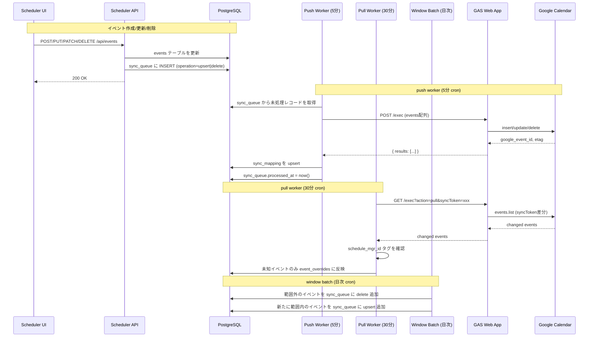

# Google Calendar 同期設計

---

## 全体フロー



---

## sync_queue の詳細フロー

### push worker のアルゴリズム

```
1. SELECT * FROM sync_queue
   WHERE processed_at IS NULL
     AND retry_count < 5
   ORDER BY created_at ASC
   LIMIT 50
   FOR UPDATE SKIP LOCKED;

2. 同一 event_id が複数あれば、最新の upsert を残し古いものは processed_at = now() でスキップ
   （delete が最新なら delete を実行）

3. GAS に送信（バッチ最大50件）

4. 成功レコード: processed_at = now()
   失敗レコード: retry_count += 1
                 scheduled_at = now() + interval '2^retry_count minutes'
                 error_message = <エラー内容>
```

### リトライバックオフ

| retry_count | 次の scheduled_at |
|-------------|------------------|
| 0 → 1 | +2分 |
| 1 → 2 | +4分 |
| 2 → 3 | +8分 |
| 3 → 4 | +16分 |
| 4 → 5 | +32分（最終試行） |

retry_count が 5 に達したレコードはアラートログを出力し、以降の処理から除外する（手動対応が必要）。

---

## sync_mapping の管理

### push 成功後

```sql
INSERT INTO sync_mapping (event_id, google_event_id, google_calendar_id, last_pushed_at)
VALUES (:event_id, :google_event_id, 'primary', now())
ON CONFLICT (event_id) DO UPDATE SET
  google_event_id = EXCLUDED.google_event_id,
  tombstone = false,
  last_pushed_at = now(),
  updated_at = now();
```

### 削除時（tombstone）

```sql
UPDATE sync_mapping
SET tombstone = true, updated_at = now()
WHERE event_id = :event_id;
```

tombstone が true のレコードは pull worker が重複削除リクエストを防ぐために参照する。

---

## 同期ウィンドウとウィンドウバッチ

### ウィンドウ定義

```
DB: 全期間保存（削除しない）
Google Calendar 同期対象: now() - 1ヶ月 〜 now() + 6ヶ月
```

### window batch（日次 cron: 毎日 03:00 JST）

```mermaid
flowchart TD
    A[window batch 開始] --> B[同期ウィンドウを計算\n window_start = now() - 1month\n window_end = now() + 6months]
    B --> C{sync_mapping が存在し\n tombstone=false かつ\n start_at < window_start または\n start_at > window_end}
    C -->|YES: 範囲外に出た| D[sync_queue に delete 追加]
    B --> E{events が存在し\n deleted_at IS NULL かつ\n sync_mapping が存在しない or tombstone=true かつ\n window_start <= start_at <= window_end}
    E -->|YES: 新たに範囲内に入った| F[sync_queue に upsert 追加]
    D --> G[完了]
    F --> G
```

---

## 同期ループ防止の仕組み

### push 時（GAS の処理）

GAS が Calendar API で insert/update する際、`description` に以下のタグを付加する。

```
<元の description の内容>

---
schedule_mgr_id:550e8400-e29b-41d4-a716-446655440000
```

タグは description の末尾に付加し、ユーザーが description を書いていても上書きしない。

### pull 時（pull worker の処理）

```typescript
function shouldSkipPulledEvent(googleEvent: CalendarEvent): boolean {
  const tag = googleEvent.description?.match(/schedule_mgr_id:([0-9a-f-]{36})/);
  if (!tag) return false;  // 外部で作られたイベントは取り込む対象

  const knownId = tag[1];
  const exists = await db.query.events.findFirst({
    where: eq(events.id, knownId),
  });
  return exists !== undefined;  // 既知IDならスキップ
}
```

---

## 競合解決ルール

| 状況 | 解決方法 |
|------|---------|
| アプリで更新 → pull で同じイベントが来た | アプリ側を優先。sync_queue に push が残っている場合はそちらを適用 |
| Calendar で手動編集 → pull で取得 | `event_overrides` に反映（元の events は変更しない） |
| アプリで削除済み → pull で来た | sync_mapping.tombstone = true なので無視 |
| Calendar で削除済み → push しようとした | GAS が 410 Gone を返す → sync_mapping.tombstone = true, sync_queue.processed_at = now() |

---

## GAS Web App インターフェース

GAS は以下の 2 つのエンドポイントを提供する。

### POST /exec — push（カレンダーへの書き込み）

リクエスト（ConoHa → GAS）:

```json
{
  "action": "push",
  "events": [
    {
      "scheduler_id": "550e8400-e29b-41d4-a716-446655440000",
      "operation": "upsert",
      "google_event_id": null,
      "title": "数学の勉強",
      "start": "2026-05-02T09:00:00Z",
      "end": "2026-05-02T11:00:00Z",
      "all_day": false,
      "location": "",
      "description": "青チャート",
      "reminders": [10]
    }
  ]
}
```

レスポンス（GAS → ConoHa）:

```json
{
  "results": [
    {
      "scheduler_id": "550e8400-e29b-41d4-a716-446655440000",
      "status": "ok",
      "google_event_id": "abc123xyz",
      "etag": "\"3082421830924000\""
    }
  ]
}
```

### GET /exec?action=pull — pull（カレンダーからの差分取得）

リクエスト:

```
GET /exec?action=pull&syncToken=<token>&calendarId=primary
```

レスポンス:

```json
{
  "next_sync_token": "...",
  "items": [
    {
      "id": "abc123xyz",
      "status": "confirmed",
      "summary": "数学の勉強",
      "start": { "dateTime": "2026-05-02T18:00:00+09:00" },
      "end":   { "dateTime": "2026-05-02T20:00:00+09:00" },
      "description": "青チャート\n\n---\nschedule_mgr_id:550e8400-...",
      "etag": "\"3082421830924000\""
    }
  ]
}
```

`syncToken` が期限切れ（410 Gone）の場合、GAS は全件取得（フルシンク）を実施し、新しい `next_sync_token` を返す。

---

## systemd タイマー設定例

```ini
# /etc/systemd/system/scheduler-push.service
[Unit]
Description=Scheduler push worker
After=network.target

[Service]
Type=oneshot
User=scheduler
WorkingDirectory=/opt/scheduler
ExecStart=/usr/bin/node scripts/push-worker.js
EnvironmentFile=/opt/scheduler/.env

# /etc/systemd/system/scheduler-push.timer
[Unit]
Description=Run scheduler push worker every 5 minutes

[Timer]
OnBootSec=1min
OnUnitActiveSec=5min
AccuracySec=10s

[Install]
WantedBy=timers.target
```

```bash
# 有効化
sudo systemctl enable --now scheduler-push.timer
sudo systemctl enable --now scheduler-pull.timer
sudo systemctl enable --now scheduler-window-batch.timer

# ログ確認
journalctl -u scheduler-push.service -f
```
