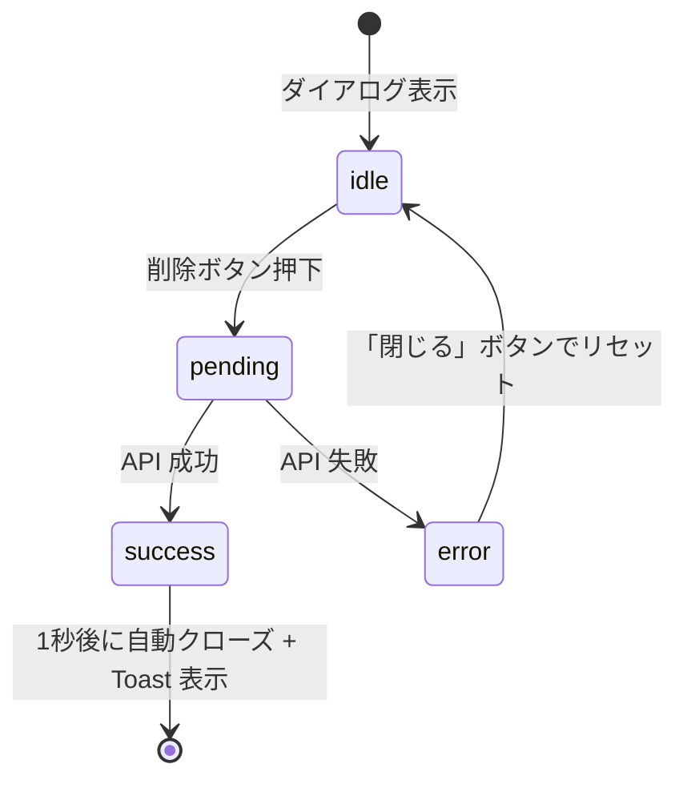

# UI/UX 改善設計

---

## 概要

旧実装で確認された 4 つの High 優先度問題を解決する。また、長押し操作・readonly 表示・Toast 通知の仕様を定義する。

---

## 問題 1: showMessage() 空実装 → Toast コンポーネント実装

### 現状の問題

`showMessage()` が空実装のため、操作の成功・失敗がユーザーに伝わらない。

### 解決設計

#### Toast の種類

| variant | 用途 | 表示色 | 自動消去 |
|---------|------|--------|---------|
| `success` | 操作成功 | 緑 (#27AE60) | 3秒後 |
| `error` | 操作失敗 | 赤 (#E74C3C) | 手動 or 8秒後 |
| `loading` | 処理中 | 青 (#3498DB) | 操作完了まで維持 |
| `info` | 情報通知 | グレー | 4秒後 |

#### 表示位置

画面右下（モバイルは下部中央）。複数同時表示時は縦に積み上げる（最大 3 件）。

#### Toast コンポーネント設計

```typescript
// shared/types/toast.ts
type ToastVariant = 'success' | 'error' | 'loading' | 'info';

type Toast = {
  id: string;
  variant: ToastVariant;
  message: string;
  description?: string;
  durationMs?: number;  // undefined = variant のデフォルト
};
```

```typescript
// frontend/src/stores/toast-store.ts (Zustand)
type ToastStore = {
  toasts: Toast[];
  show: (toast: Omit<Toast, 'id'>) => string;  // toast.id を返す
  dismiss: (id: string) => void;
  dismissAll: () => void;
};

// 使用例
const { show, dismiss } = useToastStore();

// loading → success パターン
const toastId = show({ variant: 'loading', message: 'イベントを削除中...' });
try {
  await deleteEvent(id);
  dismiss(toastId);
  show({ variant: 'success', message: 'イベントを削除しました' });
} catch {
  dismiss(toastId);
  show({ variant: 'error', message: '削除に失敗しました', description: 'しばらく待ってから再試行してください' });
}
```

#### TanStack Query との統合

```typescript
const deleteMutation = useMutation({
  mutationFn: deleteEvent,
  onMutate: () => {
    const toastId = show({ variant: 'loading', message: '削除中...' });
    return { toastId };
  },
  onSuccess: (_, __, { toastId }) => {
    dismiss(toastId);
    show({ variant: 'success', message: 'イベントを削除しました' });
    queryClient.invalidateQueries({ queryKey: ['events'] });
  },
  onError: (error, _, context) => {
    dismiss(context?.toastId ?? '');
    show({ variant: 'error', message: `削除に失敗しました: ${error.message}` });
  },
});
```

---

## 問題 2: 削除ボタン多重クリック → 操作中 disabled + 二重送信ガード

### 現状の問題

削除ボタンを素早く複数回タップすると、重複 DELETE リクエストが送信される。

### 解決設計

#### Frontend: isPending による disabled

```tsx
<button
  onClick={() => deleteMutation.mutate(eventId)}
  disabled={deleteMutation.isPending}
  className={cn(
    'btn-danger',
    deleteMutation.isPending && 'opacity-50 cursor-not-allowed'
  )}
>
  {deleteMutation.isPending ? (
    <Spinner size="sm" />
  ) : (
    '削除'
  )}
</button>
```

TanStack Query の `isPending` は mutation が実行中の間 `true` を返す。`disabled` 属性により物理的なクリックを無効化する。

#### Backend: 冪等な DELETE 実装

```typescript
// backend/src/routes/events.ts
app.delete('/api/events/:id', async (c) => {
  const { id } = c.req.param();

  const event = await db.query.events.findFirst({
    where: and(eq(events.id, id), isNull(events.deletedAt)),
  });

  if (!event) {
    // 既に削除済みでも 204 を返す（冪等性）
    return c.body(null, 204);
  }

  await db.update(events)
    .set({ deletedAt: new Date() })
    .where(eq(events.id, id));

  return c.body(null, 204);
});
```

---

## 問題 3: 削除確認後の即閉じ → 処理中→成功/失敗の状態を確実に表示

### 現状の問題

削除確認ダイアログで「削除」を押すと即座にモーダルが閉じ、処理結果が表示されない。

### 解決設計

#### 削除確認ダイアログの状態遷移



#### ダイアログコンポーネント設計

```tsx
type DeleteDialogState = 'idle' | 'pending' | 'success' | 'error';

function DeleteConfirmDialog({ eventId, onClose }: Props) {
  const [state, setState] = useState<DeleteDialogState>('idle');
  const [errorMessage, setErrorMessage] = useState('');

  const handleDelete = async () => {
    setState('pending');
    try {
      await deleteEvent(eventId);
      setState('success');
      // 1秒後にダイアログを閉じる（成功メッセージを見せてから閉じる）
      setTimeout(onClose, 1000);
    } catch (e) {
      setState('error');
      setErrorMessage(e instanceof Error ? e.message : '不明なエラー');
    }
  };

  return (
    <Dialog>
      {state === 'idle' && (
        <>
          <p>このイベントを削除しますか？</p>
          <Button variant="danger" onClick={handleDelete}>削除</Button>
          <Button variant="ghost" onClick={onClose}>キャンセル</Button>
        </>
      )}
      {state === 'pending' && (
        <div className="flex items-center gap-2">
          <Spinner />
          <span>削除中...</span>
        </div>
      )}
      {state === 'success' && (
        <div className="text-green-600">
          ✓ 削除しました
        </div>
      )}
      {state === 'error' && (
        <>
          <p className="text-red-600">削除に失敗しました: {errorMessage}</p>
          <Button variant="ghost" onClick={() => setState('idle')}>戻る</Button>
        </>
      )}
    </Dialog>
  );
}
```

---

## 問題 4: 重なりイベントタップ不能 → 重複バッジ + 一覧モーダル

### 現状の問題

同じ時間帯に複数イベントが重なると、後ろのイベントがタップ不能になる。

### 解決設計

#### 重複検出ロジック

同一日の同一時間帯に 2 件以上のイベントが重なる場合、重複グループを形成する。

```typescript
type OverlapGroup = {
  slotKey: string;        // "2026-05-02T09:00" など
  events: EventSummary[];
};

function detectOverlaps(events: EventSummary[]): OverlapGroup[] {
  // 30分スロット単位でグルーピング
  const slotMap = new Map<string, EventSummary[]>();
  for (const event of events) {
    const slot = toSlotKey(event.start_at);  // 30分単位に切り捨て
    const group = slotMap.get(slot) ?? [];
    group.push(event);
    slotMap.set(slot, group);
  }
  return Array.from(slotMap.entries())
    .filter(([, evs]) => evs.length > 1)
    .map(([slotKey, evs]) => ({ slotKey, events: evs }));
}
```

#### 表示仕様

```
通常（重複なし）:
┌─────────────────────┐
│ 数学の勉強          │
│ 09:00 - 11:00       │
└─────────────────────┘

重複あり（2件以上）:
┌───────┐ ← 高さは最大3件分（以降は「+N」バッジ）
│ 数学  │
│ +2    │ ← バッジタップで一覧モーダルを開く
└───────┘
```

#### 重複一覧モーダル

```tsx
function OverlapListModal({ group, onSelectEvent }: Props) {
  return (
    <BottomSheet>
      <h3 className="text-base font-semibold mb-3">
        {formatSlot(group.slotKey)} の予定 ({group.events.length}件)
      </h3>
      <ul className="space-y-2">
        {group.events.map((event) => (
          <li key={event.id}>
            <button
              className="w-full text-left p-3 rounded-lg border"
              style={{ borderLeftColor: event.color ?? '#ccc', borderLeftWidth: 4 }}
              onClick={() => onSelectEvent(event.id)}
            >
              <span className="font-medium">{event.title}</span>
              <span className="text-sm text-gray-500 ml-2">
                {formatEventTimeRange(event)}
              </span>
            </button>
          </li>
        ))}
      </ul>
    </BottomSheet>
  );
}
```

---

## 長押し操作仕様

### 仕様定義

| 操作 | 動作 |
|------|------|
| タップ（~200ms） | イベント詳細モーダルを開く |
| 長押し（500ms） | 追加 or 移動モードに入る。ドラッグ可能になる |
| 長押し中のドラッグ | イベント移動 |

長押しが成立する前のドラッグは一切無効とする（誤操作防止）。

### 視覚フィードバック

```
長押し中（0ms → 500ms）:
- セル枠が強調色に変化（opacity: 0.7 → 1.0）
- プログレスリング（円形）が 500ms かけて描画される
- 500ms 到達時: 触覚フィードバック（navigator.vibrate(50) が利用可能な場合）

長押し成立後:
- カーソルが grab に変わる
- イベントブロックが若干拡大（scale: 1.05）して「掴んだ」感を表現
```

### 実装例（カスタムフック）

```typescript
function useLongPress(
  onLongPress: () => void,
  options: { delay?: number } = {}
) {
  const { delay = 500 } = options;
  const timerRef = useRef<ReturnType<typeof setTimeout>>();
  const isLongPressFired = useRef(false);

  const start = useCallback((e: React.PointerEvent) => {
    isLongPressFired.current = false;
    timerRef.current = setTimeout(() => {
      isLongPressFired.current = true;
      onLongPress();
    }, delay);
  }, [onLongPress, delay]);

  const cancel = useCallback(() => {
    clearTimeout(timerRef.current);
  }, []);

  return {
    onPointerDown: start,
    onPointerUp: cancel,
    onPointerLeave: cancel,
    // ドラッグを長押し成立後のみ許可するために外部で利用
    isLongPressFired,
  };
}
```

---

## Readonly（imported イベント）の表示仕様

### ownership: 'source' の場合

- 詳細モーダル内に「このイベントは [ソース名] で管理されています」バナーを表示する
- 編集ボタンは非表示
- 削除ボタンは非表示（誤削除防止）
- 「Scheduler で編集する（切り離し）」ボタンを表示する

### 切り離し（detach）操作のフロー

```
「Scheduler で編集する」ボタン
    ↓ タップ
確認ダイアログ:
「このイベントを Scheduler で管理します。
 今後 [ソース名] からの更新は反映されなくなります。
 よろしいですか？」
    ↓ 確認
PATCH /api/events/:id  { "ownership": "detached" }
    ↓ 成功
編集ボタン・削除ボタンが表示される
Toast: "Scheduler で管理するようになりました"
```

### ownership: 'detached' の場合

- 通常の手動イベントと同じ編集 UI を表示する
- ソース名のバッジは残す（どこから来たか分かるように）

---

## Toast コンポーネント仕様（補足）

### アニメーション

```
表示: 右からスライドイン (translate-x-full → translate-x-0, 200ms ease-out)
消去: 右にスライドアウト (translate-x-0 → translate-x-full, 150ms ease-in)
```

### アクセシビリティ

```tsx
<div
  role="status"
  aria-live="polite"
  aria-atomic="true"
>
  {toasts.map((toast) => (
    <ToastItem key={toast.id} toast={toast} />
  ))}
</div>
```

- `variant: 'error'` の場合は `aria-live="assertive"` を使用する
- キーボード操作: `Escape` キーで最前面の Toast を閉じる
